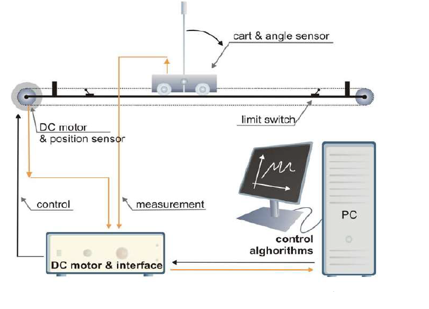

## Introduction

<b>Discipline | <b> Electrical Engineering 
:--|:--|
<b> Lab | <b> **Control and Instrumentation Lab**
<b> Experiment|     <b> **Study and operation of Inverted Pendulum System and Experiment 6**

### About the Experiment 
**System description**

The pendulum workshop can be divided into two separate control problems. First is the crane control problem, in which the goal is to move the cart into a desired position with as little oscillation of the load (pendulum arms) as possible. The other is to stabilize the inverted pendulum in an upright position. The crane control problem is very often encountered in industrial applications where load movement is incorporated. It is especially difficult to realise when cranes are placed on ships and the effect of waves is considered.The inverted pendulum task can be seen as a self-erecting control problem, which is present in missile launching and control applications.The inverted cart–pendulum is an example of under-actuated,non-minimum phase and highly unstable system.Therefore a controller design is difficult for such a system.The design becomes more difficult because of the physical constraints on track length, applied voltage and the pendulum angle.a two-loop PID controller using pole placement technique where the (dominant) closed-loop poles	are placed at the desired locations,is used here to produce control signal which helps in stabilizing the system.
  

Fig1.Inverted Cart Pendulum along with Actuator, Controller and PC 

<b>Name of Developer | <b> **Prof. Alok Kanti Deb**
:--|:--|
<b> Institute | <b>  **Indian Institute of Technology Kharagpur**
<b> Email id|     <b>  **alokkanti@ee.iitkgp.ac.in**
<b> Department |  **Department of Electrical Engineering**
<b>Webpage| <b> http://www.iitkgp.ac.in/department/EE/faculty/ee-alokkanti

### Contributors List

SrNo | Name | VLabs Developer or Integration Engineer | Designation | Department| Institute
:--|:--|:--|:--|:--|:--|
1 | **Piyali Chattopadhyay** | Developer & Integration | Project Scientist | Department of Electrical Engineering | IIT Kharagpur | 
