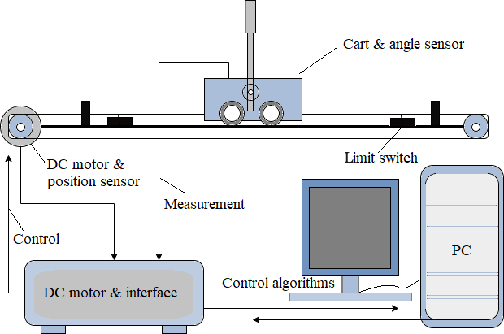

## Introduction

<b>Discipline | <b> Electrical Engineering 
:--|:--|
<b> Lab | <b> **Control and Instrumentation Lab**
<b> Experiment|     <b> **Study and operation of Inverted Pendulum System and Experiment 6**

### About the Experiment 
**System description**

The pendulum workshop can be segmented into two distinct control challenges. First is the crane control problem, focused on moving the cart to a desired position with minimal oscillation of the load (pendulum arms). Second is the task of stabilizing the inverted pendulum in an upright position. The crane control issue is frequently encountered in industrial settings where precise load movement is essential, particularly challenging when cranes operate on ships where wave effects come into play. The inverted pendulum task resembles a self-erecting control problem, relevant in applications like missile launching and control. The inverted cart-pendulum exemplifies an under-actuated, non-minimum phase, and highly unstable system, 
posing significant challenges for controller design. Complicating matters are physical constraints on track length, applied voltage and pendulum angle. To address these challenges, a two-loop PID controller utilizing pole placement technique is employed here, strategically positioning dominant closed-loop poles at desired locations to generate control signals that aid in system stabilization.

Fig. 1 explains how the control system is organised.
		  

<b>Fig. 1. Inverted Cart Pendulum along with Actuator, Controller and PC </b>

<b>Subject matter expertise | <b> **Prof. Alok Kanti Deb**
:--|:--|
<b> Institute | <b>  **Indian Institute of Technology Kharagpur**
<b> Email id|     <b>  **alokkanti@ee.iitkgp.ac.in**
<b> Department |  **Department of Electrical Engineering**
<b>Webpage| <b> http://www.iitkgp.ac.in/department/EE/faculty/ee-alokkanti

### Contributors List

SrNo | Name | VLabs Developer or Integration Engineer | Designation | Department| Institute
:--|:--|:--|:--|:--|:--|
1 | **Piyali Chattopadhyay** | Developer | Project Scientist | Department of Electrical Engineering | IIT Kharagpur | 
2 | **Subhasis Mahata** | Integration Engineer | Senior Project Scientist | Department of Mechanical Engineering | IIT Kharagpur |