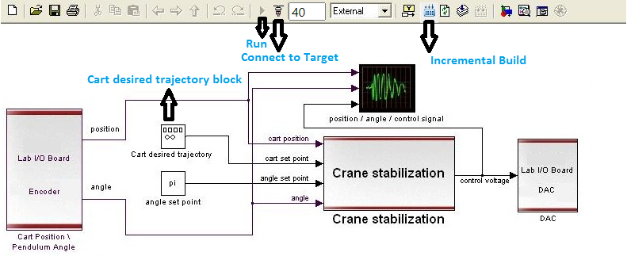

### Procedure

<b>Fig. 1. Inverted Cart Pendulum along with Actuator, Controller and PC</b>

**Steps to perform the simulation**
      
1. First click on "Start" button to observe the pendulum-cart system is moving normally on the track. Click on 'Stop' button to stop it.

2. Now under 'Controller Panel' section click on 'Crane Stabilization' to observe crane control simulation of pendulum-cart system. Initially the controller for crane stabilization is shown. Click on 'Cart desired trajectory' block to enter desired amplitude,frequency and time value of a sinusoidal trajectory.
Click on 'Ok'. Click on 'Incremental Build' icon and wait for an alert message to successfully build the model.

<b>Fig. 2. Crane Stabilization simulation block diagram</b>

3. Click on "Connect to Target" icon now and wait for the run (triangular button beside "Connect to Target") button to be enabled. Click on the green 'Power' button. Now click on 'Start' button just beside that 'Power' button. Click on the run button now to observe the simulation for crane control and graphical representation of cart position and pendulum angle (which will be around &pi;). Plot can be downloaded by clicking on 'Download' button. Now click on 'Ok' button.

4. Now under 'Controller Panel' section click on 'Pendulum Stabilization' to observe inverted pendulum control simulation of pendulum-cart system. Click on the pendulum pole to make it inverted (vertically upright position). Click on 'Incremental Build' icon and wait for an alert message to successfully build the model.

5. Click on "Connect to Target" icon now and wait for the run button to be enabled. Click on the green 'Power' button and then click on 'Start' button just beside that 'Power' button. Click on the run button now to observe the simulation for inverted pendulum control and graphical representation of cart position and pendulum angle (which will be around 0). Plot can be downloaded by clicking on 'Download' button. Now click on 'Ok' button.

