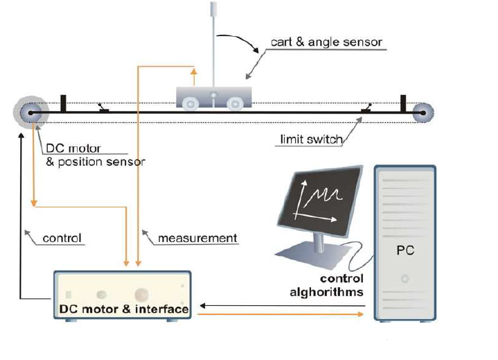

### Procedure

  
<b>Fig. 1. Schematic of the Cart-Pendulum plant</b>

 

<b>Steps to perform the simulation</b> 
<ol type="1">									

<li>Enter the value of the gain kd<b>2</b> (a positive integer value) in Controller Analysation box and click on 'Submit' button.</li> 
<li>The values of gains kp<b>1</b>, kp<b>2</b>, ki<b>1</b>, 
ki<b>2</b> and kd<b>1</b> will be calculated.</li>

  
<b>Fig. 2. Controller Analysation box in simulation</b>

 					

<li>Click on "Stabilizing controller" block in the control panel, click on 'Get calculated controller values' button. The controller values will be visible in respective boxes in controller block.
Click on 'Ok'.</li> 

  
<b>Fig. 3. Stabilizing controller and controller block in simulation</b>

   					   

<li><ul><li>Set desired time for simulation (preferably 10 sec., maximum 100 sec) in corresponding input box on top of the panel.</li>

<li>Switch on the power supply by clicking on the 'Red Switch' under digital pendulum mechanical unit.</li>

  
<b>Fig. 4. Digital pendulum mechanical unit in simulation</b>

 

<li>Click on 'Incremental Build' icon and wait for an alert message to successfully build the model.</li></ul></li>

<li><ul><li>Click on "Connect to Target" icon now and wait for the run button to get enabled.</li> 
<li>Click on the green 'Power' button on digital pendulum controller. Now click on 'Start' button just beside that 'Power' button.</li> 
<li>Click on the run button now. Provide an initial value of angle (approximately -6&deg; &le; θ &le; +6&deg;) in Controller Analysation box then click on the pendulum pole to make it inverted (vertically upright position).</li></ul></li> 						

<li>Click on 'Simulate' button to observe the simulation for inverted pendulum control and graphical representation of cart position, pendulum angle and control voltage.</li> 
<li>Plot can be downloaded by clicking on 'Download' button. Now click on 'Ok' button beside the 'Download' button.</li> 

<li> Wait untill the pendulum stops oscillating and the system settles down. Click on 'Show Table' button in control panel, then on 'Clear' button. Click on 'Stop' button on digital pendulum controller.</li> 

<li><b>Note:</b> If the cart-pendulum system becomes unstable for any initial angle, wait untill the pendulum stops oscillating and the system settles down. Then one alert message will get appeared.
After the pendulum stops completely, click on 'Clear' button, then on 'Reset' button to bring the cart-pendulum system to center position on track.</li> 

<li>Change the gain value kd<b>2</b> and repeat steps 2-8 for another initial value of angle (degree).</li> 

<li>Click on 'Compared plots' button to observe compared graphical representations of all the provided initial angle value and gain values.</li>  

</ol>

<link rel="stylesheet" href="simulation/css/PC.css">

