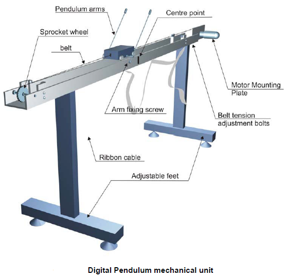

# Theory

The inverted cart–pendulum is an example of under-actuated, non-minimum phase and highly unstable system.
The first step in the analysis of control system is to derive its mathematical model to understand the working of the complete system.
  

<h2>The Plant (Pendulum-Cart)</h2> 
<b>Pendulum set description</b> 

The pendulum setup consists of a cart moving along the 1 metre length track. The cart has a shaft to which two pendulums are attached and are able to rotate freely. The cart can move back and forth causing the pendulums to swing. The movement of the cart is caused by pulling the belt in two directions by the dc motor attached at the end of the rail. By applying a voltage to the motor the force is controlled with which the cart is pulled. The value of the force depends on the value of the control voltage. The voltage is the control signal. The two variables that are read from the pendulum (using optical encoders) are the pendulum position (angle) and the cart position on the rail. The controller’s task will be to change the dc motor voltage depending on these two variables in such a way that the desired control task is fulfilled (stabilizing in an upright
position, crane control). To develop control algorithms effectively, a deep understanding of the underlying physical principles governing the process is essential, along with conducting identification experiments.
The next section explains the modelling process of the pendulum.

				
 
<b>Fig. 1. Digital Pendulum mechanical unit</b> 

 

<b>Pendulum Model</b> 
Every control project starts with the plant modelling. The phenomenological model of the pendulum is presented in Fig. 2. The phenomenological model of the pendulum is nonlinear, meaning that at least one of the states (x and its derivative or &theta; and its derivative) is an argument of a nonlinear function (x – position of cart (m), &theta; – angle of the pendulum with respect to vertical (rad)). For such a model to be presented as a transfer function (a form of linear plant dynamics representation used in control engineering), it has to be linearised. 

				
 
<b>Fig. 2. Pendulum phenomenological model</b>

 

				
 
<b>Fig. 3. Cart-pendulum system</b>

 

The cart–pendulum system, shown in Fig. 3, has two degrees of freedom of motions.  
i) Linear motion of the cart in the X – axis. 
ii) Rotation of the pendulum about the X –Y plane. 
The equations of motion are described by –

$$\ddot{\theta}=\frac{mL}{\sigma}\{[F-b\dot{x}]cos\theta - mL(\dot{\theta})^2 \ cos\theta \ sin\theta + ( m+M )g \ sin\theta\} \tag 1$$

$$\ddot{x} = \frac{1}{\sigma}\{(J+mL^2)[ F - b\dot{x} - mL(\dot{\theta})^2 sin\theta ] + mL^2g \ sin\theta \ cos\theta \} \tag 2$$

$$\sigma = mL^2( M + m cos^2\theta ) + J ( M + m )$$

Linearising equations (1) and (2) for small angle of &theta; from the vertical equilibrium point, the following state space model is obtained. 

<b>State Space Representation</b>

$$ \left[\begin{array}{cc}
\dot{x}\newline
\ddot{x}\newline
\dot{\theta}\newline
\ddot{\theta}\newline
\end{array}\right] =
\left[\begin{array}{cc}
0 & 1 & 0 & 0 \newline
0 & \frac{-(J+mL^2)b}{\sigma'} & \frac{m^2 L^2 g}{\sigma'} & 0 \newline
0 & 0 & 0 & 1 \newline
0 & \frac{- mLb}{\sigma'} & \frac{mgL(m+M)}{\sigma'} & 0 \newline
\end{array}\right]
\left[\begin{array}{cc}
x \newline
\dot{x} \newline
\theta \newline
\dot{\theta} \newline
\end{array}\right] +
\left[\begin{array}{cc}
0 \newline
\frac{(J+mL^2)}{\sigma'} \newline
0 \\\
\frac{mL}{\sigma'} \newline
\end{array}\right] \ F \tag 3 $$

$$ y = \ \left[\begin{array}{cc}
1 & 0 & 0 & 0\newline
0 & 0 & 1 & 0
\end{array}\right]
\left[\begin{array}{cc}
x \newline
\dot{x} \newline
\theta \newline
\dot{\theta} \newline
\end{array}\right] \ \tag 4 $$

where
$$x, \ \dot{x}, \ \theta \ and \  \dot{θ} \ are \ the \ states$$

and y is the output vector,

$$\sigma' = J(M+m) + MmL^2$$

<b>Plant Parameter</b>
 

<table class="table  text-center table-striped ">
<tr >
<th><b>Parameter</b></th>
<th><b>Value</b></th>				
</tr>
<tr>
<th >g - Gravity</th>
<th>9.81 m/s2</th>				
</tr>
<tr >
<th >L - Length of the pendulum</th>
<th>0.4 m</th>				
</tr>
<tr >
<th >M - Mass of cart</th>
<th>2.4 Kg</th>				
</tr>
<tr >
<th >m - Mass of the pendulum</th>
<th>0.23 Kg</th>				
</tr>
<tr >
<th >J - Moment of inertia of pendulum</th>
<th>0.099 Kg.m2</th>				
</tr>
<tr >
<th >b - Coefficient of cart friction</th>
<th>0.055 Ns/m</th>				
</tr>
<tr >
<th >d - Pendulum damping coefficient</th>
<th>0.005 Nm.s/rad</th>				
</tr>
<tr >
<th >U - Control signal</th>
<th>- 2.5 V &lt; U &lt; + 2.5 V</th>				
</tr>
<tr >
<th >F - Applied force to cart</th>
<th>- 24 N &lt; F &lt; + 24 N</th>				
</tr>
<tr >
<th >x - Position of cart from the reference</th>
<th>- 0.3 m &lt; x &lt; + 0.3 m</th>				
</tr>
<tr >
<th >&theta; - Angle of the pendulum with respect to vertical</th>
<th>&theta;&leq;0.1 rad</th>				
</tr>
</table>

 
Next, substituting the values of M, L, J, m and g in equations (3) and (4) and neglecting the friction coefficient b (which is very small compared to other parameters) the
following transfer functions are obtained 

$$\frac{X(s)}{F(s)} = \frac{( J + mL^2 )s^2 - mgL}{s^2((J( m + M ) + MmL^2)s^2 - mgL ( M + m ))}$$

$$= \frac{0.3894s^2 - 2.6506}{s^2(s^2 - 6.807)} \approx \frac{0.3894}{s^2} \tag 5$$

$$\frac{\theta(s)}{F(s)} = \frac{mLs^2}{s^2((J( m + M ) + MmL^2)s^2 - mgL ( M + m ))}$$

$$= \frac{0.2638s^2}{s^2(s^2 - 6.807)}$$				

$$\approx \frac{0.2638}{s^2 - 6.807} \tag 6$$

In equations (5) and (6) above, cancellations do not cause any
internal stability problem because the cancelled modes are
available for feedback in either of the transfer functions, the
outputs (x, &theta;) of both of which are taken as feedback for
stabilisation.

Now, the dc motor is used to convert the control voltage U to force F is represented by only a gain block of gain = 15.
Hence, the transfer functions X(s)/U(s) and &theta;(s)/U(s) become -

$$\frac{X(s)}{U(s)} \triangleq \frac{b_1}{s^2} = \frac{5.841}{s^2} \tag 7$$

$$\frac{\theta(s)}{U(s)} \triangleq \frac{b_2}{s^2 - a^2} = \frac{3.957}{s^2 - 6.807} \tag 8$$

 

<b>Two loop PID controller</b>

The two-loop PID controller to be employed for the cart–pendulum system is shown in Fig. 4. Let the two PID controllers be

$$C_1 = \frac{k^1_d s^2 +k^1_p s +k^1_i}{s} \tag 9$$
$$C_2 = \frac{k^2_d s^2 +k^2_p s +k^2_i}{s} \tag {10}$$

$$where \ k^1_p \ denotes \ proportional \ gain \ for \ C_1$$
$$ \ k^1_i \ denotes \ integral \ gain \ for \ C_1$$
$$ \ k^1_d \ denotes \ derivative \ gain \ for \ C_1$$
$$ \ k^2_p \ denotes \ proportional \ gain \ for \ C_2$$
$$ \ k^2_i \ denotes \ integral \ gain \ for \ C_2$$
$$ \ k^2_d \ denotes \ derivative \ gain \ for \ C_2$$

With the above controllers the characteristic equation for the control scheme presented in Fig. 4 becomes,

$$1 - P_1C_1 + P_2C_2 = 0 \tag {11}$$

Substituting P1, P2 (from (7) and (8)), and C1, C2 (from (9) and (10)) in (11), we get

$$1 - (\frac{b_1}{s^2}\frac{k^1_d s^2 +k^1_p s +k^1_i}{s})+ (\frac{b_2}{s^2 - a^2}\frac{k^2_d s^2 +k^2_p s +k^2_i}{s}) = 0 \tag {12}$$

which yields 

$$s^5 + ( -b_1 k^1_d + b_2 k^2_d )s^4 + ( -a^2 - b_1 k^1_p + b_2 k^2_p )s^3 + ( -b_1 k^1_i + a^2b_1k^1_d + b_2k^2_i )s^2 + ( a^2b_1k^1_p )s + ( a^2b_1k^1_i ) = 0 \tag {13}$$

Since the above characteristic equation is of fifth order, let the desired characteristic equation be

$$s^5 + p_1s^4 + p_2s^3 + p_3s^2 + p_4s + p_5 = 0 \tag {14}$$

Comparing the coefficients of (13) and (14) the following matrix equation is obtained

$$\left[\begin{array}{cc}
-b_1 & 0 & 0 & b_2 & 0 & 0 \newline
0 & -b_1 & 0 & 0 & b_2 & 0 \newline
a^2b_1 & 0 & -b_1 & 0 & 0 & b_2\newline
0 & a^2b_1 & 0 & 0 & 0 & 0\newline
0 & 0 & a^2b_1 & 0 & 0 & 0 \newline
\end{array}\right]
\left[\begin{array}{cc}
k^1_d\newline
k^1_p \newline
k^1_i\newline
k^2_d\newline
k^2_p\newline
k^2_i\newline
\end{array}\right] =
\left[\begin{array}{cc}
p_1\newline
p_2 + a^2\newline
p_3\newline
p_4\newline
p_5\newline
\end{array}\right] \ \tag {15}$$

				
 
<b>Fig. 4. Two-loop PID controller for an inverted cart–pendulum system</b>

 

<b>LQR Design</b>
 
The LQR is an optimal state feedback controller designed to minimise a particular quadratic performance index, which takes care of the design constraints. For an LTI system, 

$$\dot{X}= AX + BU$$
$$Y=CX  \tag {16}$$

The performance index is taken as,
$$J = \frac{1}{2}\int_{0}^{\infty}\{X^TQX + U^TRU \}dt \tag {17}$$

where, <i style="font-family:'century'">Q</i> is positive semi-definite (or positive definite) and 
R is positive definite. The minimisation of J is obtained by solving the algebraic Riccati equation –

$$A^TP+PA-PBR^{-1}B^TP+Q = 0 \tag {18}$$
The optimal state feedback gain vector,

$$K = -R^{-1}B^TP \tag {19}$$

Now for the inverted pendulum system, the above LQR design is carried out. Substituting the system parameters
value in (3) and (4) and then comparing these equations with (16) we get,

$$A = \ \left[\begin{array}{cc}
0 & 1 & 0 & 0\newline
0 & 0 & 0.238 & 0 \newline
0 & 0 & 0 & 1\newline
0 & 0 & 6.807 & 0\newline
\end{array}\right],
B = \ \left[\begin{array}{cc}
0\newline
0.3894\newline
0\newline
0.2638\newline
\end{array}\right] \times  15,
C = \ \left[\begin{array}{cc}
1 & 0 & 0 & 0\newline
0 & 0 & 1 & 0 \newline
\end{array}\right] \ \tag {20}$$

The A matrix being of fourth order, it may be chosen <i style="font-family:'century'">Q</i> = diag {q1, q2, q3, q4}
such that  q1 >> q2, q2 >> q4, q3 >> q4.

The optimal state feedback control gains are then found to be –

$$K = [-2.2361 \ -2.7209 \ 17.5208 \ 6.7791]^T \tag {21}$$

$$where \ q_1, \ q_2, \ q_3, \ q_4 \ are \ the \ weights \ on \ cart \ position \ (x), \ cart \ velocity \ (\dot{x}), \ pendulum$$
$$ angle \ (\theta) \ and \ pendulum \ angular \ velocity \ (\dot{\theta}) \ respectively.$$

Finally, the closed-loop poles, that is, the eigen-values of (A – BK) are obtained as -2.8862 &plusmn; 2.1606 i, -2.5800 &plusmn; 0.1461 i
  
Now, with the above four poles and choosing the fifth pole to be six times the real part of the 
dominant one amongst these four poles, the coefficients of (14) are obtained as, p1= 26.4, p2= 218.6, p3= 871.3, p4= 1721.8, p5= 1343.7
  
Next, by substituting these p1, p2, p3, p4, p5 and b1, b2, a obtained from (7), (8) in (15), we get

$$\left[\begin{array}{cc}
-5.841 & 0 & 0 & 3.957 & 0 & 0\newline
0 & -5.841 & 0 & 0 & 3.957 & 0\newline
39.759 & 0 & -5.841 & 0 & 0 & 3.957\newline
0 & 39.759 & 0 & 0 & 0 & 0\newline
0 & 0 & 39.759 & 0 & 0 & 0\newline
\end{array}\right]
\left[\begin{array}{cc}
k^1_d\newline
k^1_p \newline
k^1_i\newline
k^2_d\newline
k^2_p\newline
k^2_i\newline
\end{array}\right] =
\left[\begin{array}{cc}
26.4\newline
225.5\newline
871.3\newline
1721.8\newline
1343.7\newline
\end{array}\right] \ \tag {22}$$

				

In (22), five poles need to be placed and we have six parameters. So we need to fix one parameter. 

$$\ On \ choosing \ k^2_d \ = 10 \ (say), \ the \ PID \ parameters \ are \ obtained \ as$$

$$k^1_p =43.3 $$

$$k^1_d =2.254 $$

$$k^1_i =33.796 $$

$$k^2_p =120.9 $$

$$k^2_i = 247.43$$

 
<b>Application</b> 
<ul>
<li>The Segway</li>
<li>The human posture systems</li>
<li>The launching of a rocket etc.</li>
</ul>				
Basically, any system that requires vertical stabilization has dynamics that are similar to an inverted pendulum. The work involved in modeling and 
controlling an inverted pendulum can be carried over to many engineering areas.
			    
<link rel="stylesheet" href="simulation/css/PC.css">

								
