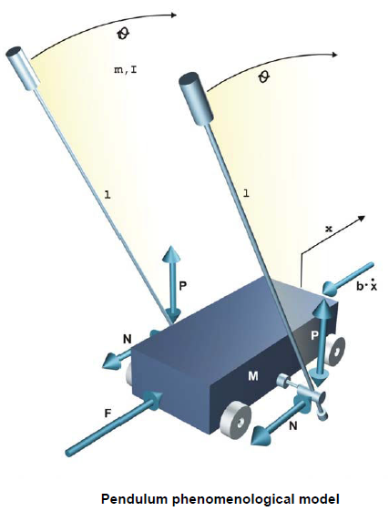

# Theory

 The inverted cart–pendulum is an example of under-actuated,non-minimum phase and highly unstable system.
The first step in the analysis of control system is to derive its mathematical model to understand the working of the complete system.

**The Plant(Pendulum-Cart):**

**Pendulum set description**

the pendulum setup consists of a cart moving along the 1 meter length track. The cart has a shaft to which two pendulums are attached and are able to rotate freely.The cart can move back and forth causing the pendulums to swing.The movement of the cart is caused by pulling the belt in two directions by the DC motor attached at the end of the rail.By applying a voltage to the motor we control the force with which the cart is pulled. The value of the force depends on the value of the control voltage.The voltage is our control signal. The two variables that are read from the pendulum (using optical encoders) are the pendulum position (angle) and the cart position on the rail.The controller’s task will be to change the DC motor voltage depending on these two variables, in such a way that the desired control task is fulfilled (stabilizing in an upright position, swinging or crane control).In order to design any control algorithms one must understand the physical background behind the process and carry out identification experiments.The next section explains the modelling process of the pendulum.
				

				

**Pendulum Model**

Every control project starts with plant modelling, so as much information as possible is given about the process itself. The mechanical model of the pendulum is presented.The phenomenological model of the pendulum is nonlinear, meaning that at least one of the states (x and its derivative or θ and its derivative) is an argument of a nonlinear function. For such a model to be presented as a transfer function (a form of linear plant dynamics representation used in control engineering), it has to be linearised.

				

The cart-pendulum has 2 DOF of motions –

• Linear motion of the cart in the X – axis.

• Rotation of the pendulum about the X –Y plane.

The equations of motion are described by –
				
$$\ddot{\theta}=\frac{mL}{\sigma}\{[F-b\dot{x}]cos\theta - mL(\dot{\theta})^2 sin\theta cos\theta +(m+M)g sin\theta\}$$
				
$$\ddot{x}=\frac{1}{\sigma}\{(J+mL^2)[F-b\dot{x}-mL(\dot{\theta})^2 sin\theta]+mL^2g sin\theta cos\theta\}$$
				
$$\sigma = mL^2(M+m cos^2\theta)+I(M+m)$$

**State Space Representation**

$$\begin{gather}
\begin{bmatrix}	\dot{x}\\\\ \ddot{x}\\\\ \dot{\theta}\\\\ \ddot{\theta}\\\\	\end{bmatrix}
=
\begin{bmatrix} 
0 & 1& 0 & 0 \\\\

0 & \frac{-(J+mL^2)b}{\sigma'} & \frac{m^2 L^2 g}{\sigma'}  & 0   \\\\
				
0 & \frac{mLb}{\sigma'} & \frac{mgL(m+M)}{\sigma'} & 0 \\\\				
				
\end{bmatrix}
				
\begin{bmatrix}
x \\\\
				
\dot{x} \\\\
				
\theta \\\\
				
\dot{\theta} \\\\					
				
\end{bmatrix}
				
+
				
\begin{bmatrix}
0 \\\\
				
\frac{-(J+mL^2)}{\sigma'} \\\\
				
0 \\\\
				
\frac{mL}{\sigma'} \\\\					
				
\end{bmatrix}
F			
				
\end{gather}
				
\begin{gather}
				
y = 
				
\begin{bmatrix}
1 & 0 & 0 & 0\\\\
0 & 0 & 1 & 0
\end{bmatrix}
				
\begin{bmatrix}
x \\\\
				
\dot{x} \\\\
				
\theta \\\\
				
\dot{\theta} \\\\					
				
\end{bmatrix}
				
\end{gather}$$
				
where 
				
$$\sigma' = I(M+m) + MmL^2$$
				
and 
				
$$\begin{gather}
				
X = 
				
\begin{bmatrix}
x & \dot{x} & \theta & \dot{\theta} 					
				
\end{bmatrix}
^T
				
\end{gather}$$

F is the force acting on the horizontal direction.

**Plant Parameter**

				

Substituting the plant parameter values and neglecting the friction co-efficient (b), the following transfer functions are obtained –
				
$$\frac{X(s)}{F(s)}= \frac{0.3894}{s^2}$$
				
$$\frac{\theta(s)}{F(s)}=\frac{0.2638}{s^2 - 6.807}$$
				
Now, the DC motor used to convert control voltage U to force F is represented by only a gain block of gain = 15 for simplicity. Hence, the transfer functions become -
				
$$\frac{X(s)}{U(s)}= \frac{5.841}{s^2}$$
				
$$\frac{\theta(s)}{U(s)}=\frac{3.957}{s^2 - 6.807}$$

**Two Loop PID Controller:**

The two-loop PID controller to be employed for the cart–pendulum system is shown in Fig below. Let the two PID controllers be

$$C_1 = \frac{k^1_d s^2 +k^1_p s +k^1_i}{s}$$
$$C_2 = \frac{k^2_d s^2 +k^2_p s +k^2_i}{s}$$
				
With the above controllers the characteristic equation for the control scheme presented in below Fig becomes,
				
$$1 - P_1C_1 + P_2C_2 = 0$$
				
substituting values,
				
$$1 - (\frac{b_1}{s^2}\frac{k^1_d s^2 +k^1_p s +k^1_i}{s})+ (\frac{b_2}{s^2 - a^2}\frac{k^2_d s^2 +k^2_p s +k^2_i}{s}) = 0$$
				
which yields a fifth order characteristic equation , let the desired characteristic equation be
				
$$s^5+p_1s^4 +p_2s^3 +p_3s^2+p_4s +p_5 = 0$$
				
$$\begin{gather}
\begin{bmatrix}
				
-b_1 & 0 & 0 & b_2 & 0 & 0 \\\\
				
0  & -b_1 & 0 & 0 & b_2 & 0 \\\\
				
a^2b_1 & 0 & -b_1 & 0 & 0 & b_2\\\\
				
0 & a^2b_1 & 0 & 0 & 0 & 0\\\\
				
0 & 0 & a^2b_1 & 0 & 0 & 0 \\\\
								
\end{bmatrix}
\begin{bmatrix}
k^1_d\\\\
k^1_p \\\\
k^1_i\\\\
k^2_d\\\\
k^2_p\\\\
k^2_i\\\\				
\end{bmatrix}
=
\begin{bmatrix}
p_1\\\\
p_2 + a^2\\\\
p_3\\\\
p_4\\\\
p_5\\\\				
\end{bmatrix}
\end{gather}$$
				

				

**LQR Design**

For an LTI system,

$$\dot{x}= AX + BU$$
$$Y=CX$$
				
The performance index is taken as,

$$J = \frac{1}{2}\int_{0}^{\infty}\{X^TQX + U^TRU \}dt$$
				
where, Q is positive semi-definite (or positive definite) and R is positive definite.The minimisation of J is obtained by solving the algebraic Riccati equation –
				
$$A^TP+PA-PBR^-1B^TP+Q=0$$
The optimal state feedback gain vector,
				
$$K=-R^-1B^TP$$
				
choose Q=diag{q1,q2,q3,q4} such that q1 >> q2,q2 >> q4, q3 >> q4 and R such that R=r >> 1

The optimal state feedback control gains are then found to be –
				
$$K = \begin{bmatrix}	-2.2361 & -2.7209 & 17.5208 & 6.7	\end{bmatrix}^T $$
				
The eigen-values of (A–BK) are obtained as -2.8862+2.1606i,-2.5800+0.1461i
				
Now, with the above four poles and choosing the fifth pole to be six times the real part of the	dominant one amongst these four poles, the coefficients are obtained as, p1 = 26.4, p2 = 218.6, p3 =871.3, p4 = 1721.8, p5 = 1343.7

Substituting these values, five poles need to be placed and we have six parameters.On choosing k2d =10(say), the PID parameters are obtained as –
				
$$k^1_p =43.3 $$
				
$$k^1_d =2.254 $$
				
$$k^1_i =33.796 $$
				
$$k^2_p =120.9 $$
				
$$k^2_i = 247.43$$

**Application:**

1. The Segway
			
2. The human posture systems</li>
	
3. The launching of a rocket etc.</li>
								
Basically, any system that requires vertical stabilization has dynamics that are similar to an inverted pendulum. The work involved in modeling and controlling an inverted pendulum can be carried over to many engineering areas.

				

						
								